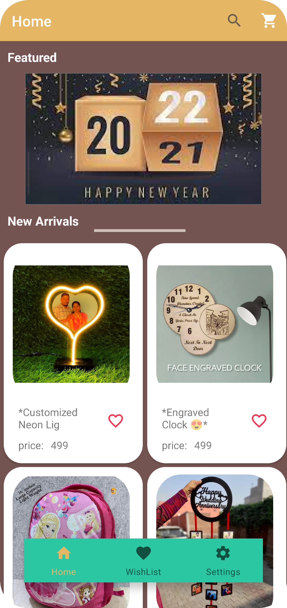

# E-Commerce-App[Gifts ordering android app]

This is converting a basic instagram bussiness account(like gifts ordering) to an android application, by not creating a complete database of images created on instagram. 
It is by using instagram api for fetching the data of images and caption on instagram bussiness acount profile into the android application, by using HTTP requests, JSON file formats
using ROOM persistant library in android studio.

Major Creations made are:
- Fetching data from instagram into android app recycler view.
- Searching amoung the data
- Uploading files from device
- Integration between this app and Gmail
- Integration between this app and Googlepay

### Technologies Used
   - Android Studio
     - Kotlin
     - XML
   - Firebase
     - Firebase Authentication
     - Firebase Realtime Database
   - Instagram basic API
   
 ### Application ScreenShots:
 &nbsp;&nbsp;&nbsp;&nbsp; 
 &nbsp;&nbsp;&nbsp;&nbsp; 
 &nbsp;&nbsp;&nbsp;&nbsp; 
 &nbsp;&nbsp;&nbsp;&nbsp; 
 
 &nbsp;&nbsp;&nbsp;&nbsp;&nbsp;
